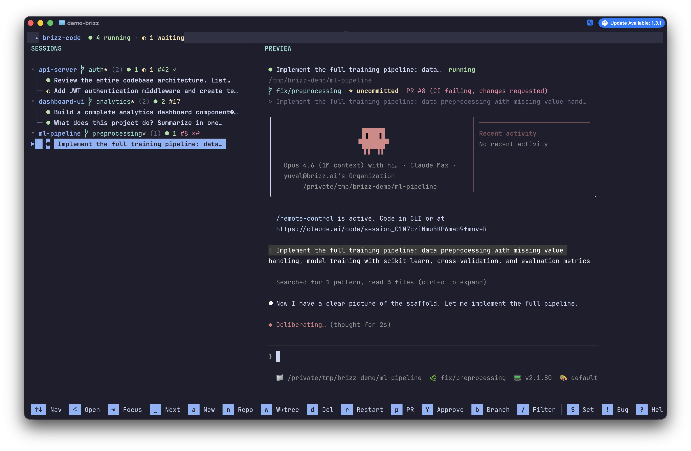

<p align="center">
  <h1 align="center">brizz-code</h1>
  <p align="center">
    <strong>Run 10 Claude Code agents. Stay sane.</strong>
  </p>
  <p align="center">
    A terminal UI for orchestrating multiple Claude Code sessions in parallel.
    <br />
    See which agents need you. Jump in, direct, jump out.
  </p>
  <p align="center">
    <a href="https://goreportcard.com/report/github.com/brizzai/brizz-code"></a>
    <a href="https://github.com/brizzai/brizz-code/releases/latest"></a>
    <a href="LICENSE"></a>
    <a href="https://golang.org/doc/devel/release.html"></a>
    <a href="https://github.com/brizzai/brizz-code/actions/workflows/ci.yml"></a>
    <a href="https://codecov.io/gh/brizzai/brizz-code"></a>
  </p>
</p>

<br />

<p align="center">
  
</p>

<p align="center">
  <em>Sessions grouped by repo &middot; Real-time status via hooks &middot; PR badges &middot; One-key approve</em>
</p>

<br />

Your one-stop shop for managing Claude Code sessions. Stop tab-switching — start orchestrating.

- 🔍 **See everything** — real-time status of every agent across all repos
- ⚡ **Act fast** — `Space` to jump, `Y` to approve, two keys and you're done
- 🌳 **Git-native** — sessions grouped by repo, branch, PR status, worktrees

## Install

### Homebrew (recommended)

```bash
brew install brizzai/tap/brizz-code
```

### Shell script

```bash
curl -fsSL https://raw.githubusercontent.com/brizzai/brizz-code/main/install.sh | bash
```

Requires [`gh`](https://cli.github.com/) authenticated with repo access.

### Go install

```bash
go install github.com/brizzai/brizz-code/cmd/brizz-code@latest
```

Requires Go 1.24+.

### Requirements

- macOS
- [tmux](https://github.com/tmux/tmux) (`brew install tmux`)
- [Claude Code](https://docs.anthropic.com/en/docs/claude-code)

## Features

### Real-Time Status Detection

Know what every agent is doing without checking each one. Status updates via Claude Code hooks — no polling, no guessing, no delay.

`● running` &nbsp; `◐ waiting` &nbsp; `● finished` &nbsp; `○ idle` &nbsp; `✕ error`

### Jump + Approve Loop

**`Space`** jumps to the next session that needs attention. **`Y`** approves the permission prompt without attaching. Two keys, back to orchestrating. This is the core loop — cycle through waiting sessions and approve them in seconds.

### Sessions Grouped by Repo

Sessions are organized under their git repo with branch name, dirty indicator, and PR status. Collapse and expand repo groups. Filter by title with **`/`**.

### GitHub PR Badges

See PR status at a glance on every repo header: `#42 ✓` approved, `#17` pending review, `#8 ✕` CI failing. Unresolved review threads counted via GraphQL. Requires [`gh`](https://cli.github.com/) (optional — hidden if not installed).

### Git Worktree Support

Press **`w`** to create a new worktree with branch picker. Zero config — works out of the box with any git repo. Worktree creation is non-blocking: a spinner shows in the sidebar while it builds. Custom workspace commands via `.bc.json` per repo.

### Auto-Naming

Sessions title themselves from your first prompt. "Add JWT authentication middleware" becomes the session name automatically. After 3 prompts, the title updates to reflect the session's actual scope. Rename manually with **`R`** to lock the title.

### Full Terminal Attach

**`Enter`** gives you a full PTY session inside the agent — colors, scrollback, mouse events, everything. **`Ctrl+Q`** detaches cleanly without killing the session. Or use **`Tab`** for split-view focus mode with keyboard forwarding.

### Fork Sessions

Press **`f`** to fork a session — branches off the Claude conversation at that point. Explore alternative directions without losing the original.

### Session Resume

Sessions automatically capture Claude's conversation ID. Restart with **`r`** and Claude picks up exactly where it left off — no context lost.

### 5 Built-In Themes

**tokyo-night** (default) · **catppuccin-mocha** · **rose-pine** · **nord** · **gruvbox**

Switch live from the settings dialog (**`S`**) with instant preview.

### Chrome Tab Control

**`p`** opens the PR in Chrome via a native messaging extension — reuses the existing tab instead of opening duplicates. Falls back to system browser if the extension isn't installed.

### Built-In Bug Reports

Press **`!`** to open the bug report dialog. It captures error history, your recent actions, system diagnostics, and debug logs — then opens a pre-filled GitHub issue. No manual copy-paste.

## Quick Start

```bash
# Launch the TUI
brizz-code

# Press 'a' to create a session in the current repo
# Press 'n' for workspace picker with path autocomplete
# Press '?' for all keybindings
```

## Keybindings

| Key | Action |
|-----|--------|
| `j` / `k` | Navigate up/down |
| `Enter` | Attach to session |
| `Ctrl+Q` | Detach from session |
| `Tab` | Focus/unfocus preview (split mode) |
| `Space` | Jump to next waiting/finished session |
| `a` | New session (current repo) |
| `n` | New session (workspace picker) |
| `w` | New worktree session |
| `Y` | Quick approve waiting prompt |
| `f` | Fork session |
| `d` | Delete session |
| `r` | Restart session |
| `R` | Rename session |
| `b` | Switch git branch |
| `e` | Open in editor |
| `p` | Open PR in browser |
| `/` | Filter sessions |
| `S` | Settings |
| `!` | Bug report / diagnostics |
| `?` | Help |
| `q` | Quit |

## How It Fits

```
You (orchestrator)
 └─ brizz-code (awareness + control)
      ├─ Claude Code session → feat/auth branch
      ├─ Claude Code session → fix/login-bug branch
      ├─ Claude Code session → feat/ci-setup branch
      └─ ...
```

Each session is one agent, one branch, one task. Claude handles the coding — commits, PRs, tests. You handle the directing. brizz-code is your cockpit.

## Contributing

See [CONTRIBUTING.md](.github/CONTRIBUTING.md) for development setup and guidelines.

## License

Apache 2.0
